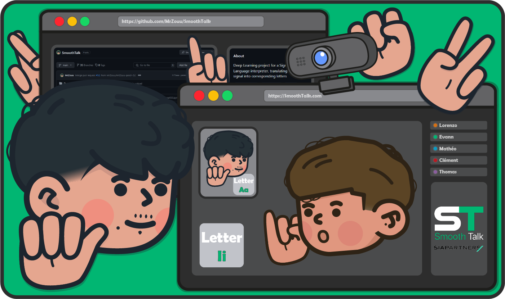
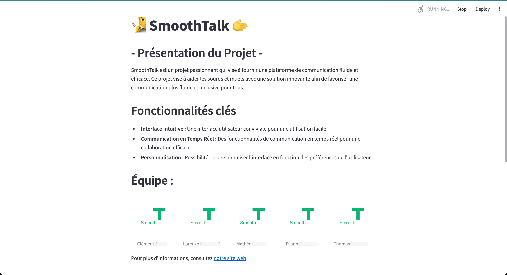
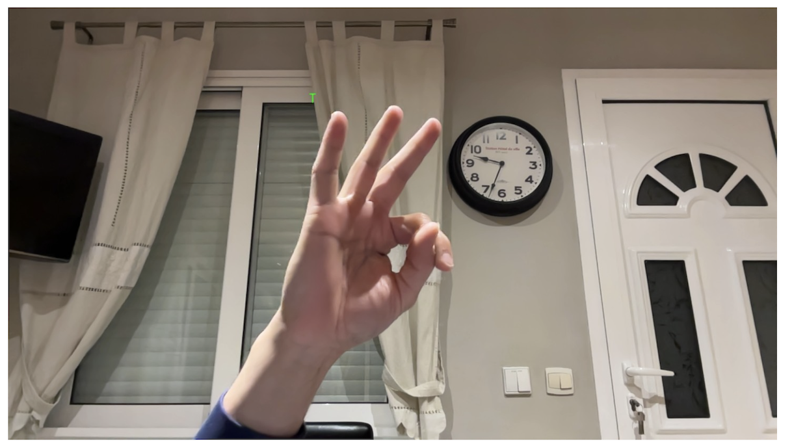
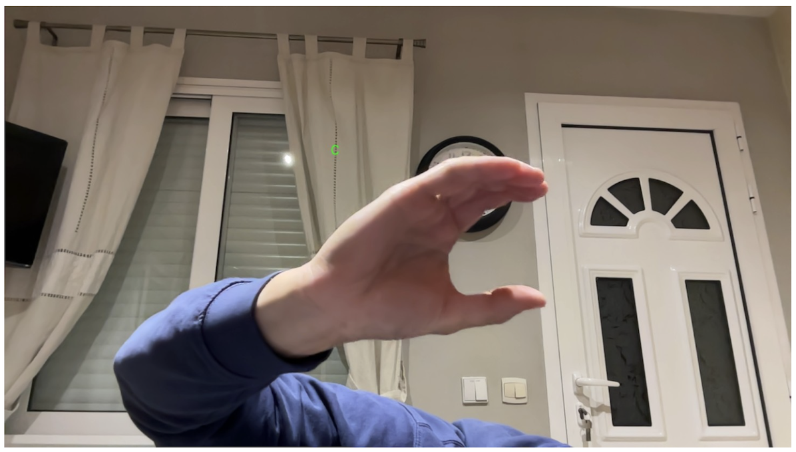

# SmoothTalk


Sign language interpreter, to switch from a video signal to a corresponding word.
This machine-learning project, powered by PyTorch, aims to develop a sign language recognition system.

<br/>

<p align="center">
	
</p>

<br/>

⚠️This project is the result of a common work, made for school with a deadline and we chose to leave it as it was at the time of submission. This project was developed in collaboration with [Sia Partners](https://www.sia-partners.com/fr).

***Project date : 2024***

<br/>

# Summary

* **[Summary](#summary)**
* **[Dependencies](#dependencies)**
* **[Training](#training)**
* **[Testing](#testing)**
* **[Streamlit](#streamlit)**
* **[GPU management](#gpu-management)**
* **[Utils folder](#utils-folder)**
* **[Tests](#tests)**
* **[Credits](#credits)**

<br/>

# Dependencies

* [**CUDA**](#cuda-toolkit---pytorch)
* [**Python**](https://www.python.org/)
* [**PyTorch**](https://pytorch.org/)

<br/>

# Training

* You need to download a dataset of images *(The appropriate amount of images remains to be defined. In our case it was around 150,000.)*. You can find a lot of datasets on [**Kaggle**](https://www.kaggle.com/datasets). The dataset must respect the format in `Dataset/T3_Echantillon.zip`. You can use the different python scritps in `utils` to manage datasets. More information in the [utils folder](#utils-folder)

* Then, in the `model_trainer.ipynb` file, specify the **path** to the dataset

* Set up **CUDA** explained below, to use the GPU and boost process speed

* Run the `model_trainer.ipynb` file

* Utilisez la version `model_trainer_colab.ipynb` si vous souhaitez utiliser l'interface [**Google Colab**](#google-colab---tensorflow-or-pytorch)

# Testing

* Specify the path to the **.pth** file generated in the code `real_time_translation.py`

* Run the `real_time_translation.py` file to load the model and use your webcam

<br/>

# Streamlit
Streamlit is an open source framework that enables you to easily create interactive web applications for machine learning and data science, simply using Python code.

This allows you to leave your IDE using the `real_time_translation.py` code, and have a proper interface.

* Install streamlit library 
  ```shell
  $ pip install streamlit
  ```

* Place files `streamlit_app.py` and `recognition_model_streamlit.py` in the same project
  
* Run the `streamlit_app.py` file with the command
  ```shell
  $ streamlit run streamlit_app.py
  ```

A streamlit web page will then appear, allowing you to use the previously generated model.

<br/>

# GPU management
##  Google Colab - Tensorflow or PyTorch
For this project, Google colab is a very useful tool for processing our data in our machine learning pipeline.  
In fact, Colab includes a gpu, enabling us to process our data more quickly and simply.  
- ## Usage
* **Import code** (jupyter file) into colab
* **Upload a dataset in zip format to the Google Drive** - associated with the google account used on Colab.
* **Change path in code and log in**
* **Respect the tree structure**

## Cuda Toolkit - Pytorch
An alternative to Google Colab is the Cuda Toolkit.
Cuda is used in particular with Pytorch. Here, you can use your own computer gpu.
The advantage is that we are not limited by the free version of Google Colab.
- ## Usage
* **Python** - We recommend installing the [3.10.7](https://www.python.org/downloads/release/python-3107/) Version
* **Cuda Toolkit** - Install version [11.7.0](https://developer.nvidia.com/cuda-toolkit-archive) - exe installer
* **Pytorch** - Version 1.13.1. Install the version corresponding to the CUDA version on the [website](https://pytorch.org/)
- Command path to enter in cmd
  
  ```shell
  $ pip install torch==1.13.1+cu117 torchvision==0.14.1+cu117 torchaudio==0.13.1 --extra-index-url https://download.pytorch.org/whl/cu117
  ```
* **Installation check** : `cmd -> python -> import torch -> torch.cuda.device_count()` -> Should display "1"

<br/>

# Utils folder
* **`Data_Augmentation.py`** - Augment dataset data/images (blur, flip, contrast).
* **`Delete_Dataset_Images.py`** - Delete a certain amount of images from a dataset.
* **`EchantillonDataset.py`** - Export a dataset sample to reduce its size.
* **`Generer_Dataset.py`** - Interface allowing you to fill a dataset file with the letters of the alphabet, from the webcam. Press "c" to capture an image and "n" to change letters.
* **`data_augment_V2.py`** - Augment dataset data/images (blur, flip, contrast), with independent selection of quantity of images per class.
* **`merge_dataset_v2.py`** - Place images from different datasets in a single file, respecting the tree structure, with independent selection of quantity of images per class.
* **`merge_different_dataset.py`** - Place images from different datasets in a single file, respecting the tree structure.

<br/>

# Tests

<p align="center"><b>Streamlit Interface</b></p>
<p align="center">
	
</p>


<p align="center"><b>Letter T</b></p>
<p align="center">
	
</p>


<p align="center"><b>Letter C</b></p>
<p align="center">
	
</p>


#  Credits
* [**Lorenzo**](https://github.com/MrZouu) : Co-creator of the project.
* [**Mathéo**](https://github.com/sc0pziion) : Co-creator of the project.
* [**Clement Auray**](https://github.com/Clementauray) : Co-creator of the project.
* [**Evann Ali-Yahia**](https://github.com/EvannAyh) : Co-creator of the project.
* [**Thomas**](https://github.com/ThhoommaassR) : Co-creator of the project.
